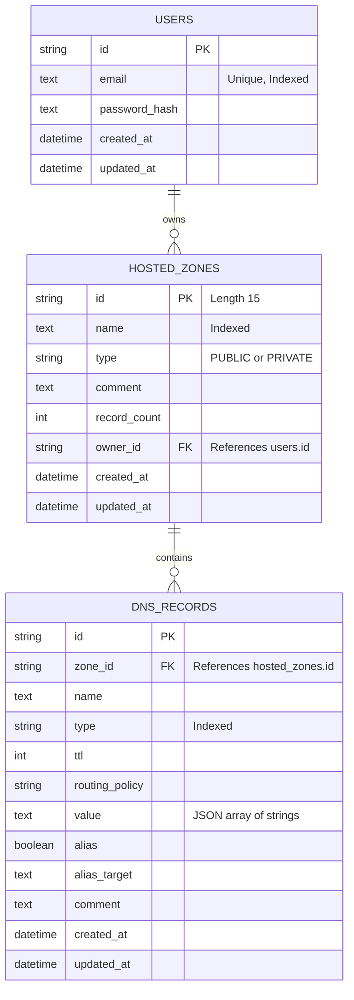

# AWS Route53 Clone

> A functional clone of AWS Route53 built with FastAPI + Next.js

## 🌍 Live Demo
- **Frontend App:** [https://scaler-ai-assignment-nine.vercel.app](https://scaler-ai-assignment-nine.vercel.app)
- **Backend API:** [https://scalerai-assignment-backend.onrender.com](https://scalerai-assignment-backend.onrender.com)
- **API Swagger Docs:** [https://scalerai-assignment-backend.onrender.com/docs](https://scalerai-assignment-backend.onrender.com/docs)

**Demo Credentials:**
- **Email:** `admin@route53.local`
- **Password:** `Admin1234!`

## 🚀 Quick Start
```bash
docker-compose up
```
Open [http://localhost:3000](http://localhost:3000)  
**Login:** admin@route53.local / Admin1234!

## Features
- **Authentication & Authorization**
  - JWT-based login, logout, and registration
  - Secure session management and RFC 7807 error compliance
- **Hosted Zones Management**
  - Create, view, update, and delete public and private hosted zones
  - Auto-generated 14-character zone IDs (e.g., Z1D633PJN98FT9)
  - Auto-creation of default NS and SOA records for new zones
- **DNS Records Management**
  - Support for multiple DNS record types (A, AAAA, CNAME, TXT, MX, NS, SOA, PTR, SRV, CAA)
  - Bulk deletion of records
  - Multi-value records handled securely as JSON arrays
- **UI/UX Experience**
  - Pixel-close UI matching the real AWS Route53 dashboard
  - Responsive design with dark navy sidebar, orange accents, and AWS typeface
  - Fully client-side state handling with optimistic updates using TanStack Query

## Architecture Overview
```text
  [ Browser ]
       |
     HTTP
       |
  [ Next.js App Router (Port 3000) ]
       |
   REST API Calls
   (React Query)
       |
  [ FastAPI Backend (Port 8000) ]
       |
   SQLAlchemy ORM
       |
  [ SQLite (WAL Mode) ]
```

## Tech Stack
| Layer | Technology | Purpose |
|-------|------------|---------|
| **Frontend** | Next.js 14 | App Router for modern React architecture and fast rendering |
| **Frontend UI** | Tailwind CSS + shadcn/ui | Pixel-perfect, accessible, and responsive component styling |
| **Frontend State**| TanStack Query (React Query) | Server state management, caching, and optimistic UI updates |
| **Validation** | Zod | End-to-end type-safe form and payload validation |
| **Backend** | FastAPI (Python 3.11) | High-performance, async-ready REST API |
| **Database** | SQLite + WAL mode | Lightweight, high-concurrency database |
| **ORM & Migrations**| SQLAlchemy + Alembic | Database modeling, relationships, and schema migrations |
| **Authentication**| passlib + python-jose | JWT token generation and bcrypt password hashing |

## Database Schema


## API Overview
| Method | Path | Auth | Description |
|--------|------|------|-------------|
| POST | `/api/v1/auth/register` | No | Register a new user account |
| POST | `/api/v1/auth/login` | No | Authenticate and receive a JWT access token |
| POST | `/api/v1/auth/logout` | Yes | Acknowledge logout (client must discard token) |
| GET | `/api/v1/auth/me` | Yes | Return the currently authenticated user |
| POST | `/api/v1/auth/seed` | No | [DEV ONLY] Seed the demo admin user |
| POST | `/api/v1/hosted-zones` | Yes | Create a new hosted zone |
| GET | `/api/v1/hosted-zones` | Yes | List hosted zones for the current user |
| GET | `/api/v1/hosted-zones/{zone_id}` | Yes | Get a single hosted zone by ID |
| PUT | `/api/v1/hosted-zones/{zone_id}` | Yes | Update a hosted zone (comment and/or type) |
| DELETE | `/api/v1/hosted-zones/{zone_id}` | Yes | Delete a hosted zone and all its records |
| POST | `/api/v1/hosted-zones/{zone_id}/records` | Yes | Create a DNS record in a hosted zone |
| GET | `/api/v1/hosted-zones/{zone_id}/records` | Yes | List DNS records in a hosted zone |
| POST | `/api/v1/hosted-zones/{zone_id}/records/bulk-delete` | Yes | Bulk delete DNS records |
| GET | `/api/v1/hosted-zones/{zone_id}/records/{record_id}` | Yes | Get a single DNS record |
| PUT | `/api/v1/hosted-zones/{zone_id}/records/{record_id}` | Yes | Update a DNS record |
| DELETE | `/api/v1/hosted-zones/{zone_id}/records/{record_id}` | Yes | Delete a DNS record |

## Local Development (without Docker)

### Backend Setup
1. **Navigate to backend directory**: `cd backend`
2. **Create virtual environment**: `python -m venv venv`
3. **Activate virtual environment**:
   - macOS/Linux: `source venv/bin/activate`
   - Windows: `venv\Scripts\activate`
4. **Install dependencies**: `pip install -r requirements.txt`
5. **Set environment variables**: Copy `.env.example` to `.env`
6. **Apply migrations**: `alembic upgrade head`
7. **Seed database**: `python -m app.seed`
8. **Run server**: `uvicorn app.main:app --reload` (or `make dev-backend` at root)

### Frontend Setup
1. **Navigate to frontend directory**: `cd frontend`
2. **Install dependencies**: `npm install`
3. **Set environment variables**: Copy `.env.local.example` to `.env.local`
4. **Run development server**: `npm run dev` (or `make dev-frontend` at root)

## Project Structure
```text
.
├── backend/               # FastAPI backend application
│   ├── alembic/           # Database migration scripts
│   ├── app/               # Main backend source code
│   │   ├── models/        # SQLAlchemy ORM definitions
│   │   ├── routers/       # API route handlers
│   │   ├── schemas/       # Pydantic validation schemas
│   │   ├── services/      # Business logic and database operations
│   │   └── utils/         # Helper functions (pagination, etc.)
│   ├── requirements.txt   # Python dependencies
│   └── route53.db         # SQLite database file
├── frontend/              # Next.js frontend application
│   ├── public/            # Static assets
│   ├── src/
│   │   ├── app/           # Next.js App Router pages
│   │   ├── components/    # Reusable React components (shadcn/ui)
│   │   ├── lib/           # Utility functions and API clients
│   │   └── styles/        # Global Tailwind CSS styles
│   ├── package.json       # Node.js dependencies
│   └── tailwind.config.ts # Tailwind configuration
├── docker-compose.yml     # Docker composition for local dev
├── Makefile               # Convenient command runner
└── README.md              # Project documentation
```

## Design Decisions

**Why SQLite with WAL mode**
SQLite simplifies local development and deployment by eliminating the need for an external database server like PostgreSQL. However, default SQLite suffers from poor concurrency. By enabling Write-Ahead Logging (WAL mode), we allow multiple readers to access the database simultaneously while a write transaction is occurring, providing excellent performance for a typical CRUD dashboard without full DB locking.

**Why React Query over Redux/Zustand for server state**
Since the dashboard relies heavily on server state (zones, records, auth) rather than complex client-side state, TanStack Query is the optimal choice. It natively handles caching, background refetching, deduping identical requests, and loading/error states. This keeps the frontend architecture extremely clean and eliminates boilerplate compared to Redux or Zustand.

**Route53 UX recreation approach**
To match the AWS Route53 UI closely, we leveraged Tailwind CSS to create a custom design system mirroring AWS's visual language. This includes using the specific dark navy tones for the sidebar, sharp geometric borders, orange call-to-action buttons, and precise typography spacing. `shadcn/ui` provided a solid accessible foundation for complex interactive components like modals and tables, which we then restyled to look identical to AWS equivalents.

**JWT mock auth rationale**
Real AWS IAM is incredibly complex. For this clone, we implemented a robust but simplified JWT-based authentication system. Passwords are securely hashed using bcrypt, and stateless JWTs govern session access. This ensures our API remains secure and RESTful, and error payloads strictly follow the RFC 7807 standard.

## Known Limitations
- Real DNS resolution not implemented (strictly an administration UI)
- No actual AWS VPC integration or private DNS routing enforcement
- Auth is simplified (no MFA, no IAM roles, no access policies)

## License
MIT
